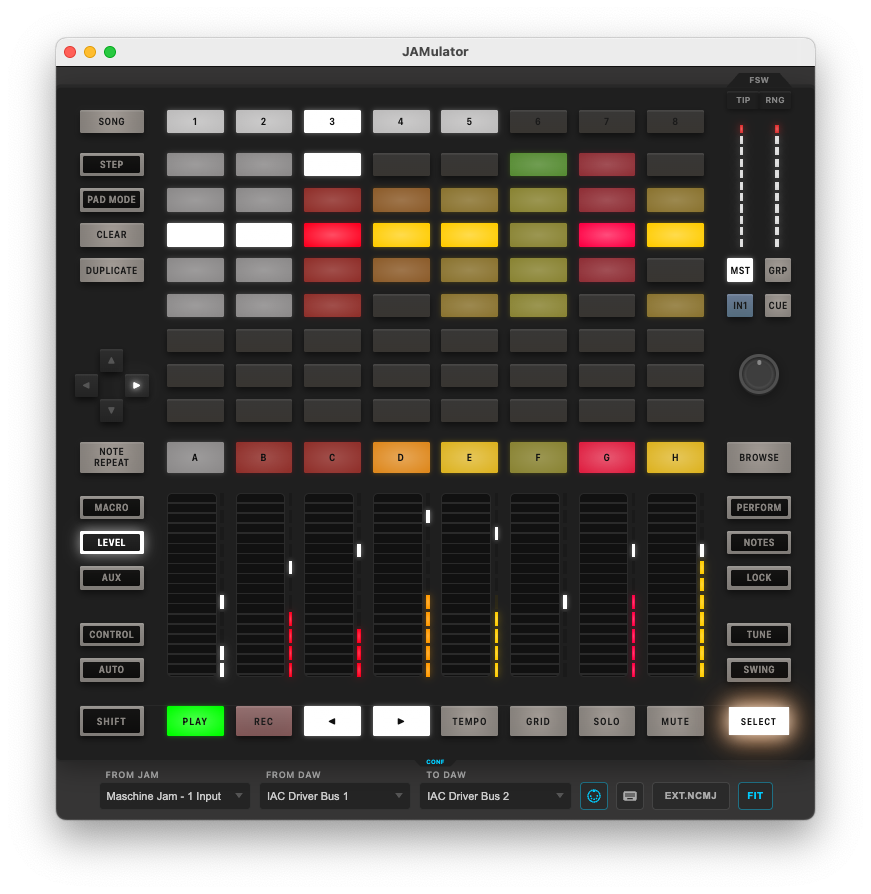
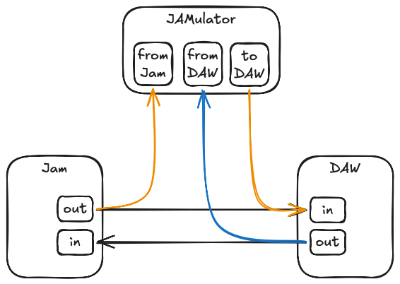

# JAMulator: virtual Maschine Jam

A complete emulation of the Native Instruments Maschine Jam controller **in MIDI mode**. Built as a single-page vanilla JS app: no framework, no build tools, no dependencies.



* Displays all controller actions
* Responds with lights to all feedback
* Supports custom mappings
* Looks nice
* Controllable by keyboard

**Use cases:**
1. Virtual MIDI controller for DAW use; test controller scripts without physical hardware
2. On-screen mirror (in 3-way mode): reflects all button presses, LED colors, and touch interactions in real-time

> [!NOTE]
> We say DAW but mean mostly Bitwig with a Jam extension (like [MonsterJam](https://github.com/unthingable/monster-jam)).

## Quick Start

```bash
run.sh
```

Or manually:

1. Run a Local HTTP Server: `python3 -m http.server 8000` or use VS Code Live Server extension
1. Open in browser: `http://localhost:8000`

### Create MIDI Ports

Jamulator cannot create ports on its own. You'll need two virtual ports so that Jamulator can talk to DAW.

* **macOS**: Use the Audio MIDI Setup app (built-in) to create an IAC (Inter-Application Communication) bus, which then appears as a MIDI port that Web MIDI can connect to.
* **Windows**: Third-party tools like loopMIDI or virtualMIDI.
* **Linux**: `modprobe snd-virmidi` or ALSA's `aconnect`.

### Connect MIDI Ports

Select your ports and click **Connect** (or type `.`). Connections auto-reconnect when ports reappear. All ports are optional.

## UI

Main panel is exactly the Jam surface, all controls are interactive.

- **Click buttons** → MIDI messages are sent to the output port
- **Drag touch strips** up/down
- **Scroll the encoder** (mouse wheel) or **click-drag** to turn
- **Click the encoder** to toggle touch; **Shift+click** to toggle press

Click events are visibly indicated by a ripple, a held button will also emit an orange glow.
Encoder glows orange on push, teal on just touch.

Many buttons respond to keystrokes. Key chords are possible by using keystrokes or holding OPT/ALT and clicking multiple buttons.

### Footswitch

Under **FSW** tab in top right corner there are **TIP** and **RNG** indicators, for footswitch tip and ring. They are clickable.

Toggle indicator visibility by clicking FSW tab.

### Control Panel

Visible below the Jam. Toggle visibility by pressing **CONF** tab or `,` key.

| Control | Description |
|---------|-------------|
| **From Jam** port | Receives control events from a real Jam (button presses, strips, encoder) |
| **From DAW** port | Receives LED feedback from your DAW/controller script (addressed to Jam) |
| **To DAW** port | Sends control events (buttons, etc.) to DAW |
| MIDI plug icon | Toggles MIDI on/off (the CONF tab color reflects this state) |
| Keyboard icon | Choose a keyboard preset |
| Mapping button | Load another Native Instruments .ncmj controller mapping |
| **FIT** button | Toggles between resizable controller (drag lower corners) and resizable window (controller occupies full width) |

## Standalone use (no hardware)
No real Jam nearby? Don't have one but always wanted to try? No problem! Just leave "From Jam" port empty and use the app.

## Keyboard Shortcuts

Jamulator responds to keyboard, multiple keyboard mappings are supported. "Mnemonic" preset is included, can add more in `keyboard.js` and switch via keyboard mapping in toolbar.

### Mnemonic Preset
Most buttons are mapped to mnemonic keys — hold a key to press, release to let go:

| Key | Button | | Key | Button |
|-----|--------|-|-----|--------|
| Space | Play | | `s` | Select |
| `r` | Record | | `x` | Clear |
| `d` | Duplicate | | `c` | Control |
| `l` | Level | | `m` | Macro |
| `b` | Browse | | `a` | Auto |
| `t` | Tempo | | `g` | Grid |
| `k` | Lock | | `n` | Note Repeat |
| `w` | Swing | | `p` | Encoder push |
| `[` | ◀ Arrow | | `]` | ▶ Arrow |
| Shift | Shift | | `.` | Toggle MIDI connection |
| `,` | Settings | | | |

**Alt+key** or **Alt+click** latches a button on — press again to release. Useful for key chords (Shift, Lock, Solo, etc).

## Three-way mirror

An advanced use case where Jamulator sits between DAW and Jam as a virtual copy.
Jam and Jamulator mirror each other and are usable simultaneously.

This requires tapping into DAW<>Jam MIDI streams as follows:

* DAW sends to both Jam and Jamulator
* their output is merged into DAW
  




You will want a way to set up this routing, e.g. with a routing tool (MIDI Patchbay on Mac, MIDI-OX on Windows). Alternatively, [MonsterJam](https://github.com/unthingable/monster-jam) supports dual-ported mode and can use the two additional (virtual) ports directly.

## Requirements

- Modern browser with **Web MIDI API** support (Chrome, Edge, Opera; Firefox requires flag)
- **HTTPS or localhost** (Web MIDI requires secure context)
- System MIDI ports (virtual or physical)

## Troubleshooting

### "MIDI access denied"
- Ensure HTTPS or localhost
- Check browser allows Web MIDI (some require per-site permission)
- Ensure SysEx is allowed if using `.ncmj` files

### No MIDI ports appear
- On Mac: Audio MIDI Setup → enable IAC Driver
- On Windows: Virtual MIDI tools (loopMIDI)
- On Linux: ALSA or JACK

### LED colors not showing
- Verify the "From DAW" input is connected
- Check that color messages are being sent on the correct channel
- Open browser DevTools console for any JS errors

## References

- [MonsterJam extension](https://github.com/unthingable/monster-jam) — Source of MIDI mappings
- [Native Instruments Maschine Jam](https://www.native-instruments.com/en/products/maschine/maschine-jam/)

## License

This emulator is provided as-is for development and testing. Native Instruments Maschine Jam is a trademark of Native Instruments.
